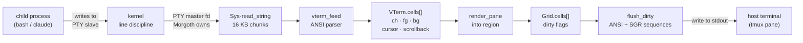
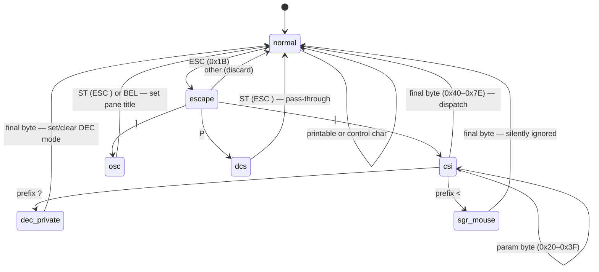
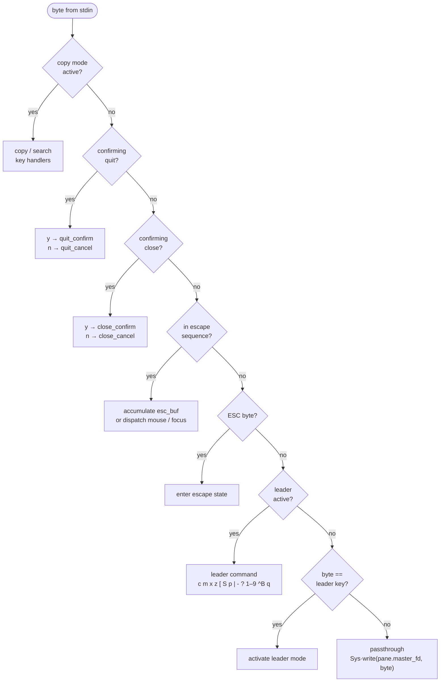

# Morgoth — Design Notes

## Vision

A TUI terminal multiplexer purpose-built for Claude Code power users. Multiple
instances in a single window, with a monitor pane that surfaces session metadata
(context usage, token consumption, cost) alongside the terminals.

Secondary goal: dogfood [Sigil](https://github.com/Daemoniorum-LLC/sigil-lang) in
a real-world systems application.

## Architecture

Morgoth is a single-file Sigil application (`src/morgoth.sg`, ~3300 lines).

### Component Map

| Section | Responsibility |
|---------|---------------|
| Constants | Version, leader key byte, box-drawing chars, escape sequences |
| Cell / Region / Grid | Screen buffer primitives; flat array with dirty tracking |
| Pane | PTY fd, VTerm, child PID, region, type, title, alive flag |
| Layout Engine | `recompute_grid`: N panes → (rows, cols) minimizing aspect distortion |
| VTerm Emulator | ANSI state machine: normal → escape → CSI / OSC / DCS |
| Copy Mode | Text extraction, cursor movement, selection, search, clipboard |
| Rendering | Borders, content, status bar, overlays, diff flush |
| Input Handling | Leader key, copy/search intercept, mouse, close/quit confirmation |
| Config + Profiles | JSON config loader; named profile files in `~/.morgoth/profiles/` |
| Monitor Plugin | Reads `~/.claude/stats-cache.json` and `current-task` |
| Terminal Control | Alt screen, raw mode, mouse tracking, termios save/restore |
| Signal Handling | `SIGTERM`, `SIGINT`, `SIGWINCH` via `sigaction` |
| Pane Management | Create, close, zoom, relayout, forced-grid splitting |
| Session | Save/restore `~/.morgoth/session.json` on quit/startup |
| Shutdown | `SIGTERM` → wait → `SIGKILL` → restore terminal |
| Event Loop | Batch poll, adaptive sleep, PTY drain, coalesced flush |

### Data Flow: PTY Output to Screen



### Event Loop

```
startup:
    terminal_init()          # save termios, set raw mode, alt screen, mouse
    load_config()
    load_profile()           # pane type array
    recompute_grid()         # (rows, cols) for N panes
    spawn panes (PTY + bash)
    initial render
    session restore prompt   # poll(stdin, 3s); drain stdin before main loop

main loop:
    check SIGTERM / SIGINT   → running = false
    check SIGWINCH           → vterm_resize + Pty·set_size + relayout

    poll_fds([stdin, pty0, pty1, ...], timeout)   # ONE syscall per iteration
                                                  # timeout = 0 when active,
                                                  # POLL_INTERVAL_MS when idle
    if stdin ready:
        read_string(0, 256)
        for each byte:
            copy-mode intercept → leader intercept → passthrough to PTY
            action dispatch: focus, zoom, create, close, quit, search, …

    for each pane:
        if terminal && pty ready:
            drain loop (16 KB chunks, 64 KB budget)
            vterm_feed → render region
        if monitor && refresh interval:
            read stats → render monitor

    coalesced flush_dirty(screen)   # one write per iteration
    had_activity_prev = had_activity
```

### VTerm State Machine



SGR attributes are stored per-cell as integers. True color uses a packed
encoding: `256 + R*65536 + G*256 + B` distinguishes 24-bit from 256-color.

### Input Routing

Each byte from stdin passes through a fixed-priority intercept chain. The
order matters: copy mode must catch `/` before the leader handler sees it,
and quit confirmation must catch `y` before passthrough sends it to bash.



### Grid Layout Algorithm

`recompute_grid(n, screen_h, screen_w)` finds `(rows, cols)` that minimizes
`|pane_w - pane_h * 2|` — the 2:1 width:height ratio that matches the
aspect ratio of typical monospace font glyphs. On an 80×24 terminal with
9 panes this produces a 2×5 grid, not 3×3.

### PTY Boundary

Real OS fds are `< 4000`. Fake fds used in tests start at `4000+`:

| Range | Purpose |
|-------|---------|
| 0–3 | Real stdin/stdout/stderr + first real fd |
| 4–3999 | Real OS fds (PTY masters, pipes, sockets) |
| 4000–4999 | Fake pipes (test stubs) |
| 5000–5999 | Fake PTYs (test stubs) |
| 7000+ | Fake background process PIDs (test stubs) |

For fds `>= 0 && < 4000`, native `libc` paths run before fake-map checks.

### Fd 0 (stdin)

In raw-mode native builds, stdin is read with `libc::read(0, buf, n)` —
never via Rust's `io::stdin()`, which conflicts with the terminal's raw mode.

### PTY Slave Termios

The PTY slave is intentionally **not** `cfmakeraw`'d. Child shells (bash,
readline) set their own termios on startup. Setting raw mode on the slave
prevents the line discipline from echoing readline input back through the
master to Morgoth.

## Design Decisions

### Single-file Architecture

`morgoth.sg` is one file (~3300 lines). Sigil has no module system yet.
Sections are separated by comments. This works well for a project of this
size and makes the entire program grep-searchable without navigation.

### Flat Grid vs Tree Layout

Morgoth uses a flat `(rows × cols)` grid, not a tree (split-pane) layout.
This covers the common case (equal-size panes) with far simpler code. Manual
splitting (`^B+|`, `^B+-`) adjusts `forced_rows`/`forced_cols` to get
asymmetric layouts without a tree engine.

### Synchronous Poll Loop

No async runtime, no threads. A synchronous `libc::poll` on all fds per
iteration gives sub-millisecond response with a single thread and no
synchronization overhead. Phase 17 reduced this from N+2 syscalls per frame
to 1.

### Monitor Pane as Plugin

The monitor pane reads from files (`~/.claude/stats-cache.json`,
`~/.claude/current-task`, `git rev-parse`) rather than receiving IPC from
Claude Code processes. This decouples Morgoth from Claude Code's internals —
any process that writes those files will be reflected in the monitor.

### Claude Integration via Message Queue

Copy-mode yank delivers text directly to Claude Code panes through an
in-process message queue. Each pane has a UUID and an inbox. The focused
Claude pane is identified by its OSC 2 window title ("Claude" or "✳");
yank writes to its inbox which is drained every event loop iteration.

External processes reach panes through two interfaces:
- **Per-pane FIFOs** (`~/.morgoth/fifos/<uuid>`): plain text, polled
  non-blocking each iteration alongside PTY fds
- **Unix domain socket** (`~/.morgoth/morgoth.sock`): structured JSON with
  `recipient`, `kind`, and `payload` fields; `recipient:"notify"` is a
  magic sentinel that pushes to the status bar instead of a pane inbox

This eliminates the tmux dependency and the fragile file-watching approach.
The `bin/morgoth-send` script provides a convenient CLI over the socket.
