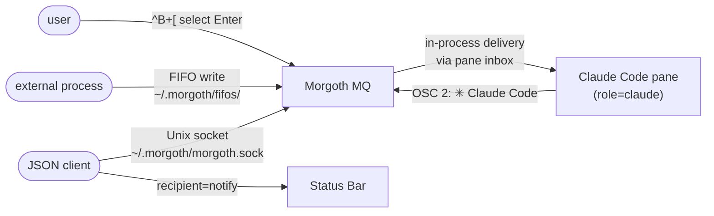

# Morgoth

A TUI terminal multiplexer purpose-built for Claude Code, written in
[Sigil](https://github.com/Daemoniorum-LLC/sigil-lang).

```
╔═[1:bash]══════════════╦═[2:System Monitor]═════╗
║                        ║ Branch:  main           ║
║  > implementing        ║ Context: 42%            ║
║    auth module...      ║ Tokens:  12.4k          ║
║                        ║ Session: $0.34          ║
╠═[3:bash]══════════════╬═[4:bash]════════════════╣
║                        ║                         ║
║  > running tests       ║  > reviewing PR #127    ║
║                        ║                         ║
╚═══════════════════════╩═════════════════════════╝
 NORMAL  [1/4] terminal │ ^B+c: new  ^B+x: close  ^B+z: zoom  Morgoth v0.1.0
```

## Why

Claude Code power users run multiple instances simultaneously. Generic
multiplexers (tmux, zellij) work but aren't Claude-aware. Morgoth surfaces
Claude session metadata — context usage, token consumption, cost — in a
dedicated monitor pane alongside your terminals.

## Requirements

- Linux (PTY and signal primitives are Linux-specific)
- [Sigil](https://github.com/Daemoniorum-LLC/sigil-lang) compiler built with
  `native` feature
- Linux kernel 5.6+ (for full `AF_UNIX` socket support)

## Installation

```bash
# 1. Build the Sigil compiler
cd sigil-lang/parser
cargo build --release --no-default-features --features jit,native,protocols

# 2. Clone Morgoth (if separate)
git clone https://github.com/Daemoniorum-LLC/morgoth
```

## Running

```bash
# Recommended: use the launch wrapper (handles terminal restore on crash)
./morgoth/launch.sh

# Direct (no crash protection)
sigil-lang/parser/target/release/sigil run morgoth/src/morgoth.sg
```

## Key Bindings

**Leader key:** `Ctrl-B` (configurable in `config.json`)

### Navigation

| Binding | Action |
|---------|--------|
| `^B n` / `^B p` | Focus next / previous pane |
| `^B 1`–`^B 9` | Focus pane by number |
| Mouse click | Focus clicked pane |

### Pane Management

| Binding | Action |
|---------|--------|
| `^B c` | Create terminal pane |
| `^B m` | Create monitor pane |
| `^B x` | Close focused pane (confirmation required) |
| `^B z` | Zoom / unzoom focused pane |
| `^B \|` | Split: add pane, force +1 column |
| `^B -` | Split: add pane, force +1 row |

### Scrollback

| Binding | Action |
|---------|--------|
| `^B k` | Scroll up |
| `^B j` | Scroll down |
| `^B /` | Enter scrollback search |

### Copy Mode (`^B [`)

| Binding | Action |
|---------|--------|
| `h` `j` `k` `l` | Cursor movement |
| `0` / `$` | Beginning / end of line |
| `w` / `b` | Word forward / backward |
| `g` / `G` | First / last line |
| `Ctrl-U` / `Ctrl-D` | Half-page up / down |
| `Space` | Start / cancel character selection |
| `V` | Toggle line selection mode |
| `Enter` | Yank to clipboard (OSC 52) + deliver to Claude pane via MQ |
| `/` | Enter search |
| `n` / `N` | Next / previous search match |
| `q` / `ESC` | Exit copy mode |

### Profiles + Session

| Binding | Action |
|---------|--------|
| `^B S` | Save current pane layout to active profile |
| `^B p` | Open profile picker |

### Pane Reordering

| Binding | Action |
|---------|--------|
| `^B <` | Swap focused pane with previous (focus follows) |
| `^B >` | Swap focused pane with next (focus follows) |

### Broadcast Mode

| Binding | Action |
|---------|--------|
| `^B B` | Toggle broadcast — keystrokes go to **all** alive terminal panes |

### Other

| Binding | Action |
|---------|--------|
| `^B ?` | Show help overlay |
| `^B ^B` | Send literal `Ctrl-B` to focused pane |
| `^B q` | Quit (confirmation required) |

## Configuration

Morgoth reads `~/.morgoth/config.json` on startup. All keys are optional.

```json
{
  "shell": "/bin/bash",
  "leader_key": 2,
  "scrollback_lines": 1000,
  "max_panes": 12,
  "hmr": false,
  "session_restore": true,
  "bindings": {
    "new_terminal": "c",
    "new_monitor":  "m",
    "close_pane":   "x",
    "zoom_toggle":  "z",
    "copy_mode":    "[",
    "save_profile": "S",
    "help":         "?"
  }
}
```

**`leader_key`** is the ASCII byte of the leader character (`2` = `Ctrl-B`).

## Profiles

Pane layouts are saved in `~/.morgoth/profiles/`. The active profile at
startup is `default.json`. Use `^B+p` to load a different profile; use
`^B+S` to save the current layout.

Profile files contain a JSON array of pane types:

```json
["terminal", "monitor", "terminal"]
```

## Claude Code Integration

The system monitor pane reads from:
- `~/.claude/stats-cache.json` — context usage, token count, session cost
- `~/.claude/current-task` — active task description (if present)

It also runs `git rev-parse --abbrev-ref HEAD` to show the current branch,
and displays a live count of Claude-role panes and the MQ socket path.

Morgoth includes a built-in pane message queue (MQ) that delivers text from
copy mode directly to Claude Code panes — no external tools required.



**Copy mode yank** (`^B+[`, select, `Enter`) detects the focused Claude pane
by its OSC 2 title (any title containing "Claude" or "✳") and writes the
selection directly to that pane's PTY master — it appears in Claude's input
box instantly.

**External producers** can inject text via FIFO or socket:

```bash
# Paste text into a specific pane
echo "hello" > ~/.morgoth/fifos/<pane-uuid>

# Paste via socket (with UUID)
echo '{"recipient":"<uuid>","kind":"paste","payload":"hello"}' \
  | nc -U ~/.morgoth/morgoth.sock

# Push a status bar notification (no UUID needed)
echo '{"recipient":"notify","kind":"notify","payload":"Tests: 47 passed"}' \
  | nc -U ~/.morgoth/morgoth.sock
```

**`bin/morgoth-send`** is a convenience wrapper that resolves pane roles to
UUIDs automatically:

```bash
morgoth-send --to-role claude "implement the auth module"
morgoth-send --kind notify "Deploy complete: v1.2.3"
```

**`bin/morgoth-list`** prints all active panes with their UUID, role, title,
and FIFO path:

```
UUID                                   ROLE       TITLE            FIFO
----                                   ----       -----            ----
550e8400-e29b-41d4-a716-446655440000   claude     Claude Code      ~/.morgoth/fifos/550e...
```

Pane UUIDs, roles, and titles are listed in `~/.morgoth/registry.json`
(updated on startup and OSC title changes). All messages are also appended to
`~/.morgoth/messages.jsonl` and replayed into pane inboxes on the next
Morgoth startup.

A machine-readable manifest is written to `~/.morgoth/manifest.json` on
startup and updated on every OSC title change. It contains the socket path,
registry path, FIFO directory, and live Claude pane count — useful for agents
and tools that need to discover Morgoth's endpoints programmatically.

## Tests

```bash
# Run all 222 tests
./run_tests.sh

# Filter by phase
./run_tests.sh --filter P8
./run_tests.sh --filter P15
```

## License

Licensed under either of

- [Apache License, Version 2.0](LICENSE-APACHE)
- [MIT License](LICENSE-MIT)

at your option.

Copyright 2026 Lightspeed DMS, LLC
